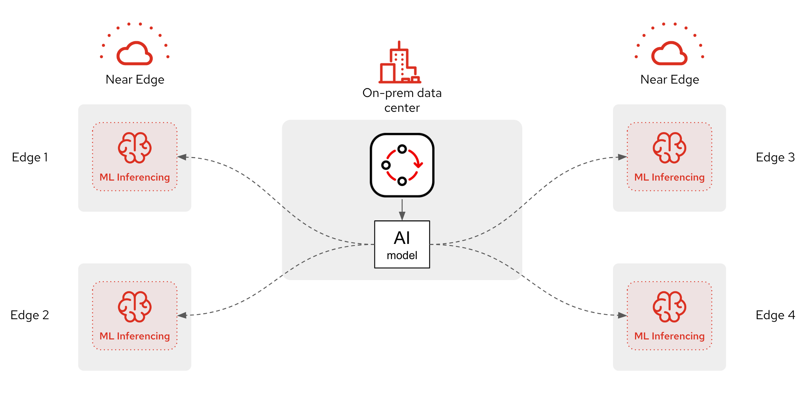

# Solution Pattern: Edge-to-Core Data Pipelines for AI/ML

The Edge to Core Data Pipelines for AI/ML solution pattern provides an architecture solution for scenarios in which edge devices generate image data, which must be collected, processed, and stored at the edge before being utilized to train AI/ML models at the core data center or cloud.

This solution pattern contains resources to showcase a full circle continuous motion of data to capture training data, train new ML models, deploy them, serve them, and expose the service for clients to send inference requests.


## Home page

Head to the Solution Pattern's home page to get the full context of this demo sources. You can find it following the link below:

- [**Solution Pattern Home Page**](https://redhat-solution-patterns.github.io/solution-pattern-edge-to-cloud-pipelines/solution-pattern-edge-to-core-pipelines/index.html)


## Tested with

* RH OpenShift 4.12.12
* RHODF 4.12.11 provided by Red Hat
* RHOAI 2.8.0 provided by Red Hat
* RHO Pipelines 1.10.4 provided by Red Hat
* AMQ-Streams 2.6.0-1 provided by Red Hat
* AMQ Broker 7.11.6 provided by Red Hat
* Red Hat build of Apache Camel 4
* Camel K 1.10.6 provided by Red Hat
* RH Service Interconnect 1.4.4-rh-1 provided by Red Hat


## Deployment instructions

### 2. Provision an OpenShift environment

1. Provision the following RHDP item:
    * [**Solution Pattern - Edge to Core Data Pipelines for AI/ML**](https://demo.redhat.com/catalog?item=babylon-catalog-prod/community-content.com-edge-to-core.prod&utm_source=webapp&utm_medium=share-link)

   <br/>

1. Alternatively, if you don't have access to RHDP, ensure you have an OpenShift environment available and install Red Hat OpenShift AI, meeting the pre-requisite product versions (see '_Tested with_' section to inspect product versions).

<br/>

### 2. Deploy the Solution Pattern

The instructions below assume:
* You either have _Docker_, _Podman_ or `ansible-playbook` installed on your local environment.
* You have provisioned an OCP instance (tested with OCP 4.12 + RHOAI 2.8), using RHDP, and a bastion server is available.

<br/>


#### Install the demo

1. Clone this GitHub repository:

    ```sh
    git clone https://github.com/brunoNetId/sp-edge-to-cloud-data-pipelines-demo.git
    ```

1. Change to root directory of the project.

    ```sh
    cd sp-edge-to-cloud-data-pipelines-demo
    ```

    <br/>

1. When running with _Docker_ or _Podman_
    
    1. Configure the `KUBECONFIG` file to use (where kube details are set after login).

        ```sh
        export KUBECONFIG=./ansible/kube-demo
        ```

    1. Login into your OpenShift cluster from the `oc` command line.

        ```sh
        oc login --username="admin" --server=https://(...):6443 --insecure-skip-tls-verify=true
        ```

        Replace the `--server` url with your own cluster API endpoint.

    1. Run the Playbook

        1. With Docker:
        
            ```sh
            docker run -i -t --rm --entrypoint /usr/local/bin/ansible-playbook \
            -v $PWD:/runner \
            -v $PWD/ansible/kube-demo:/home/runner/.kube/config \
            quay.io/agnosticd/ee-multicloud:v0.0.11  \
            ./ansible/install.yaml
            ```
        
        1. With Podman:
        
            ```sh
            podman run -i -t --rm --entrypoint /usr/local/bin/ansible-playbook \
            -v $PWD:/runner \
            -v $PWD/ansible/kube-demo:/home/runner/.kube/config \
            quay.io/agnosticd/ee-multicloud:v0.0.11  \
            ./ansible/install.yaml

            ```
                        
            for SE Linux enabled hosts use the Z flag to set the correct SELinux label on the bind mount:

            ```sh
            podman run -i -t --rm --entrypoint /usr/local/bin/ansible-playbook \
            -v $PWD:/runner:Z \
            -v $PWD/ansible/kube-demo:/home/runner/.kube/config:Z \
            quay.io/agnosticd/ee-multicloud:v0.0.11  \
            ./ansible/install.yaml         

            ```
    <br/>

1. When running with Ansible Playbook (installed on your machine)

    1. Login into your OpenShift cluster from the `oc` command line.

        For example with: \
        ```sh
        oc login --username="admin" --server=https://(...):6443 --insecure-skip-tls-verify=true
        ```
        (Replace the `--server` url with your own cluster API endpoint)

    1. Set the following property:
        ```
        TARGET_HOST="lab-user@bastion.b9ck5.sandbox1880.opentlc.com"
        ```
    2. Run Ansible Playbook
        ```sh
        ansible-playbook -i $TARGET_HOST,ansible/inventory/openshift.yaml ./ansible/install.yaml
        ```

<br/>

### 3. Deploy more Edge environments

The default installation deploys the following zones:
 - `edge1`: represents the Edge environment where live inferencing occurs.
 - `central`: represents the Core data centre where Models are trained

<br>

The Solution Pattern's architecture allows for more _Edge_ environments to be connected to the main data centre, as per the illustration below:



To deploy new _Edge_ environments, use the same commands as above, but adding the following environment parameter:
- `-e EDGE_NAME=[your-edge-name]`

For example, using the following parameter definition:
```sh no-copy
... ./ansible/install.yaml -e EDGE_NAME=zone2
```
will create a new namespace `edge-zone2` where all the _Edge_ applications and integrations will be deployed.

<br/>

### 3. Undeploy the Solution Pattern

If you wish to undeploy the demo, use the same commands as above, but with:
 - `./uninstall.yaml`

Instead of:
 - ~~`./install.yaml`~~
